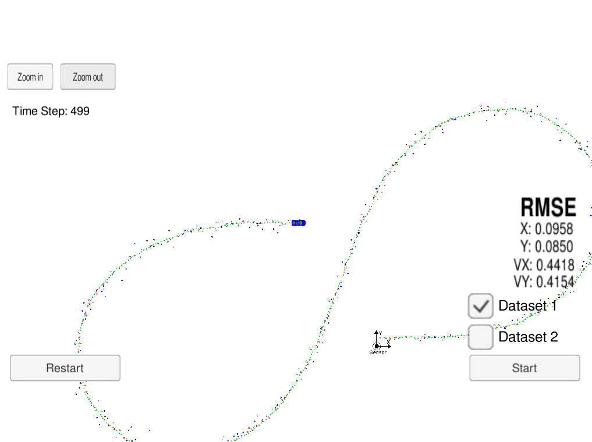

# Extended Kalman Filter

Kalman Filter to estimate the state of a moving object with LIDAR & RADAR measurements (from simulator)

## Dependencies
* [Self Driving Car Simulator](https://github.com/udacity/self-driving-car-sim/release)
* [uWebSocketIO](https://github.com/uWebSockets/uWebSockets)

## Build

1. mkdir build
2. cd build
3. cmake ..
4. make
5. ./ExtendedKF

## Other Important Dependencies

* cmake >= 3.5
 * All OSes: [click here for installation instructions](https://cmake.org/install/)
* make >= 4.1
  * Linux: make is installed by default on most Linux distros
  * Mac: [install Xcode command line tools to get make](https://developer.apple.com/xcode/features/)
  * Windows: [Click here for installation instructions](http://gnuwin32.sourceforge.net/packages/make.htm)
* gcc/g++ >= 5.4
  * Linux: gcc / g++ is installed by default on most Linux distros
  * Mac: same deal as make - [install Xcode command line tools]((https://developer.apple.com/xcode/features/)
  * Windows: recommend using [MinGW](http://www.mingw.org/)

